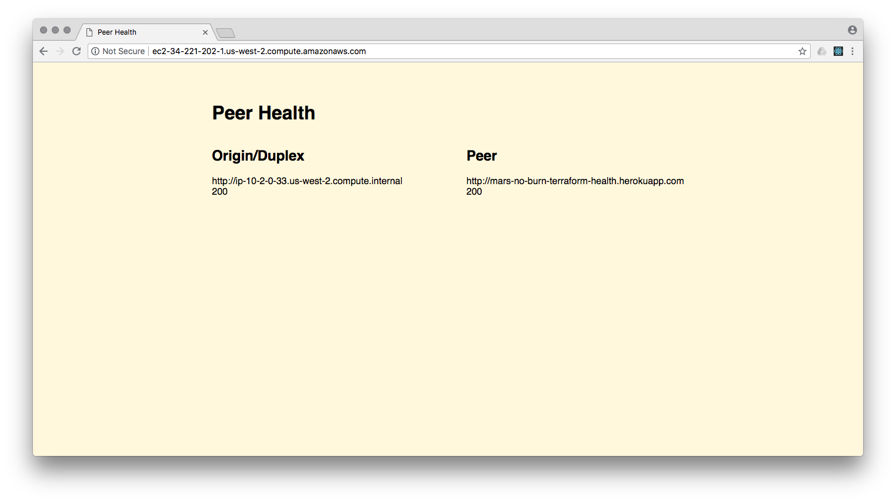

# VPC peered with a Private Space

This example provisions the **heroku_aws_vpc** module, a new Private Space, peers them automatically, and deploys a Heroku app and an AWS ECS app that form a two-way (duplex) health check.


## Requirements

An [AWS IAM](https://console.aws.amazon.com/iam/home) user (`aws_access_key` & `aws_secret_key` in Usage below).

Name suggestion: `terraform-vpc-peered-health-provisioner`

With policies:
* **AmazonEC2FullAccess**
* **AmazonECS_FullAccess**
* **AmazonVPCFullAccess**
* **IAMFullAccess**
* **CloudWatchLogsFullAccess**

## Usage

```bash
terraform apply \
  -var name=my-project \
  -var heroku_email=name@example.com \
  -var heroku_api_key=wwwww \
  -var heroku_enterprise_team=my-team \
  -var aws_access_key=xxxxx \
  -var aws_secret_key=yyyyy \
  -var aws_region=us-west-2 \
  -var instance_public_key='ssh-rsa xxxxxxxxx…' 
```

Once apply completes successfully, visit the output `health_public_url` in a web browser.

⏲ *It may take a few minutes for all services to start & DNS records to propagate.*

Eventually, the Health Check web UI should reflect a healthy duplex connection:


